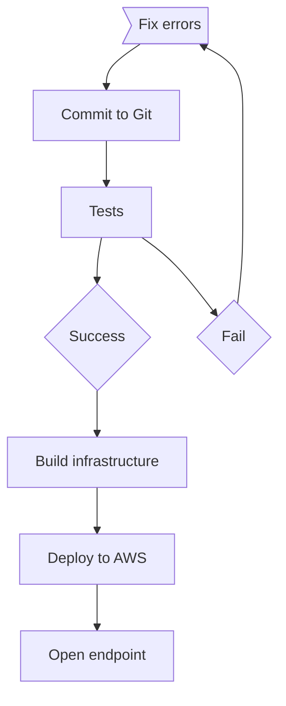
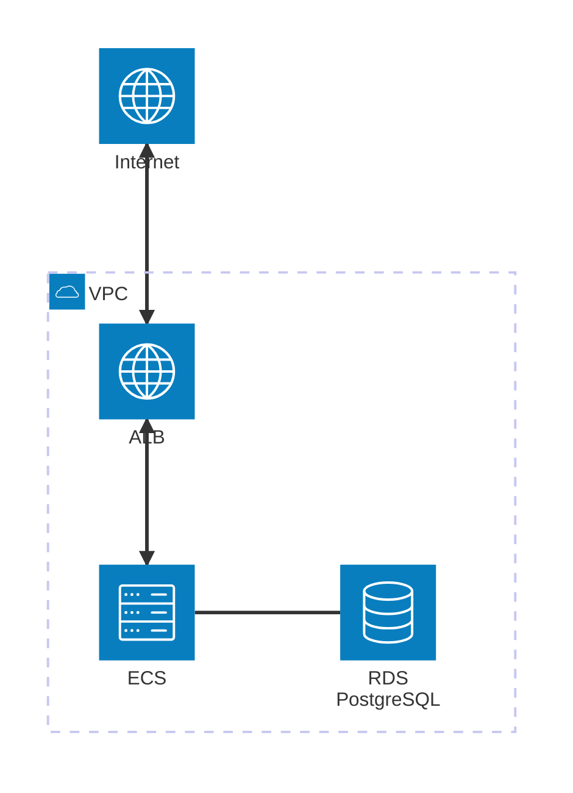

# sonalake
Sonalake DevOps Engineer TA

## Requirements
- AWS account access with permissions for provisioning required services
- AWS Certificate Manager - Create Certificate in eu-west-1

## Features
- Application Load Balancer facing internet with SSL termination
- Elastic Container Service for hosting application container
- IAM Policy as Code
- RDS Postgres Database 
- Basic logging with 7 day retention
- Security Groups for ALB, ECS and RDS
- Single region hosted resources (Costs vs Resiliency)

## Changelog

## Project sketch

## Infrastructure Diagram

## TODO
- Terraform statefile stored in S3 or DynamoDB
- Backup solution (Database snapshots, storage for it)
- Modular structure for reusability of resources and making code DRY
- Consider staging from Dev --> Test --> Prod
- Pipeline for CI/CD of application with security in mind (trivy to scan image fx.)
- Monitoring for infrastructure and application (port availability, traffic, access(connections), HTTP codes logging, alerting)
- Adjust log management in CloudWatch
- Scaling (AZ, Region)
