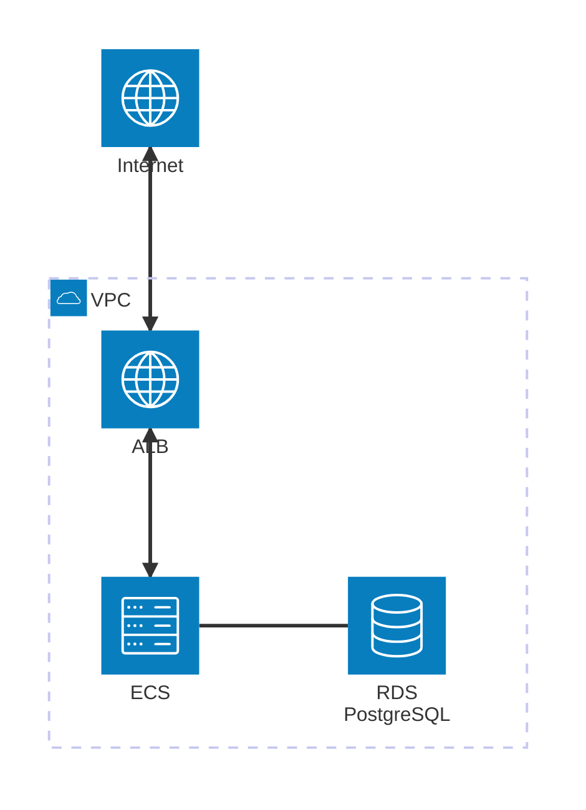

# Technical Assignment Project
DevOps Engineer TA

## Requirements
- AWS account access with permissions for provisioning required services
- AWS Certificate Manager - Create Certificate in eu-central-1

## Features
- Application Load Balancer facing internet with SSL termination
- Elastic Container Service for hosting application container
- IAM Policy as Code
- RDS Postgres Database 
- Basic logging with 7 day retention
- Security Groups for ALB, ECS and RDS
- Single region hosted resources (Costs vs Resiliency)

## Changelog

## Project sketch

## Infrastructure Diagram

## TODO
- Terraform statefile stored in S3 and locking in DynamoDB
- Backup solution (Database snapshots, storage for it)
- Modular structure for reusability of resources and making code DRY
- Consider staging from Dev --> Test --> Prod
- Pipeline for CI/CD of application with security in mind (trivy to scan image fx.)
- Monitoring for infrastructure and application (port availability, traffic, access(connections), HTTP codes logging, alerting)
- Adjust log management in CloudWatch (longer retention?)
- Scaling (AZ, Region)

<!-- BEGIN_TF_DOCS -->
## Requirements

| Name | Version |
|------|---------|
|  [terraform](#requirement\_terraform) | >= 1.8.0 |
|  [aws](#requirement\_aws) | ~> 5.0 |
|  [random](#requirement\_random) | ~> 3.0 |

## Providers

| Name | Version |
|------|---------|
|  [aws](#provider\_aws) | ~> 5.0 |
|  [random](#provider\_random) | ~> 3.0 |

## Modules

No modules.

## Resources

| Name | Type |
|------|------|
| [aws_acm_certificate.main](https://registry.terraform.io/providers/hashicorp/aws/latest/docs/resources/acm_certificate) | resource |
| [aws_acm_certificate_validation.main](https://registry.terraform.io/providers/hashicorp/aws/latest/docs/resources/acm_certificate_validation) | resource |
| [aws_cloudwatch_log_group.ecs_logs](https://registry.terraform.io/providers/hashicorp/aws/latest/docs/resources/cloudwatch_log_group) | resource |
| [aws_db_instance.main](https://registry.terraform.io/providers/hashicorp/aws/latest/docs/resources/db_instance) | resource |
| [aws_db_subnet_group.main](https://registry.terraform.io/providers/hashicorp/aws/latest/docs/resources/db_subnet_group) | resource |
| [aws_ecr_repository.app_repo](https://registry.terraform.io/providers/hashicorp/aws/latest/docs/resources/ecr_repository) | resource |
| [aws_ecs_cluster.main](https://registry.terraform.io/providers/hashicorp/aws/latest/docs/resources/ecs_cluster) | resource |
| [aws_ecs_service.app](https://registry.terraform.io/providers/hashicorp/aws/latest/docs/resources/ecs_service) | resource |
| [aws_ecs_task_definition.app](https://registry.terraform.io/providers/hashicorp/aws/latest/docs/resources/ecs_task_definition) | resource |
| [aws_eip.nat_gateway_eip](https://registry.terraform.io/providers/hashicorp/aws/latest/docs/resources/eip) | resource |
| [aws_iam_role.ecs_task_execution_role](https://registry.terraform.io/providers/hashicorp/aws/latest/docs/resources/iam_role) | resource |
| [aws_iam_role.ecs_task_role](https://registry.terraform.io/providers/hashicorp/aws/latest/docs/resources/iam_role) | resource |
| [aws_iam_role_policy.ecs_task_secrets_policy](https://registry.terraform.io/providers/hashicorp/aws/latest/docs/resources/iam_role_policy) | resource |
| [aws_iam_role_policy_attachment.ecs_task_execution_role_policy](https://registry.terraform.io/providers/hashicorp/aws/latest/docs/resources/iam_role_policy_attachment) | resource |
| [aws_internet_gateway.main](https://registry.terraform.io/providers/hashicorp/aws/latest/docs/resources/internet_gateway) | resource |
| [aws_lb.app](https://registry.terraform.io/providers/hashicorp/aws/latest/docs/resources/lb) | resource |
| [aws_lb_listener.http_redirect](https://registry.terraform.io/providers/hashicorp/aws/latest/docs/resources/lb_listener) | resource |
| [aws_lb_listener.https](https://registry.terraform.io/providers/hashicorp/aws/latest/docs/resources/lb_listener) | resource |
| [aws_lb_target_group.app](https://registry.terraform.io/providers/hashicorp/aws/latest/docs/resources/lb_target_group) | resource |
| [aws_nat_gateway.main](https://registry.terraform.io/providers/hashicorp/aws/latest/docs/resources/nat_gateway) | resource |
| [aws_route53_record.acm_validation](https://registry.terraform.io/providers/hashicorp/aws/latest/docs/resources/route53_record) | resource |
| [aws_route53_record.alb_a_record](https://registry.terraform.io/providers/hashicorp/aws/latest/docs/resources/route53_record) | resource |
| [aws_route53_zone.main](https://registry.terraform.io/providers/hashicorp/aws/latest/docs/resources/route53_zone) | resource |
| [aws_route_table.private](https://registry.terraform.io/providers/hashicorp/aws/latest/docs/resources/route_table) | resource |
| [aws_route_table.public](https://registry.terraform.io/providers/hashicorp/aws/latest/docs/resources/route_table) | resource |
| [aws_route_table_association.private](https://registry.terraform.io/providers/hashicorp/aws/latest/docs/resources/route_table_association) | resource |
| [aws_route_table_association.public](https://registry.terraform.io/providers/hashicorp/aws/latest/docs/resources/route_table_association) | resource |
| [aws_secretsmanager_secret.rds_master_password](https://registry.terraform.io/providers/hashicorp/aws/latest/docs/resources/secretsmanager_secret) | resource |
| [aws_secretsmanager_secret_version.rds_master_password_version](https://registry.terraform.io/providers/hashicorp/aws/latest/docs/resources/secretsmanager_secret_version) | resource |
| [aws_security_group.alb](https://registry.terraform.io/providers/hashicorp/aws/latest/docs/resources/security_group) | resource |
| [aws_security_group.ecs_service](https://registry.terraform.io/providers/hashicorp/aws/latest/docs/resources/security_group) | resource |
| [aws_security_group.rds](https://registry.terraform.io/providers/hashicorp/aws/latest/docs/resources/security_group) | resource |
| [aws_subnet.private](https://registry.terraform.io/providers/hashicorp/aws/latest/docs/resources/subnet) | resource |
| [aws_subnet.public](https://registry.terraform.io/providers/hashicorp/aws/latest/docs/resources/subnet) | resource |
| [aws_vpc.main](https://registry.terraform.io/providers/hashicorp/aws/latest/docs/resources/vpc) | resource |
| [random_password.rds_password](https://registry.terraform.io/providers/hashicorp/random/latest/docs/resources/password) | resource |
| [aws_availability_zones.available](https://registry.terraform.io/providers/hashicorp/aws/latest/docs/data-sources/availability_zones) | data source |

## Inputs

| Name | Description | Type | Default | Required |
|------|-------------|------|---------|:--------:|
|  [allowed\_source\_cidrs](#input\_allowed\_source\_cidrs) | CIDR blocks allowed to access the application | `list(string)` | <pre>[   "75.2.60.0/24" ]</pre> | no |
|  [app\_container\_port](#input\_app\_container\_port) | Port on which container listens on | `number` | `8080` | no |
|  [aws\_region](#input\_aws\_region) | AWS region | `string` | `"eu-central-1"` | no |
|  [desired\_ecs\_tasks](#input\_desired\_ecs\_tasks) | Number of desired ECS tasks. | `number` | `1` | no |
|  [docker\_image\_name](#input\_docker\_image\_name) | Name of the Docker image | `string` | `"app-repo"` | no |
|  [ecs\_fargate\_cpu](#input\_ecs\_fargate\_cpu) | CPU units for ECS Fargate tasks | `number` | `256` | no |
|  [ecs\_fargate\_memory](#input\_ecs\_fargate\_memory) | Memory for ECS Fargate tasks | `number` | `512` | no |
|  [project\_name](#input\_project\_name) | Name for tagging resources | `string` | `"sonalake-devops-ta"` | no |
|  [rds\_db\_name](#input\_rds\_db\_name) | Name of PostgreSQL database | `string` | `"sonalake-rest"` | no |
|  [rds\_instance\_class](#input\_rds\_instance\_class) | Instance type for RDS database | `string` | `"db.t3.micro"` | no |
|  [rds\_master\_username](#input\_rds\_master\_username) | Master username for the RDS PostgreSQL database | `string` | `"postgres"` | no |
|  [root\_domain\_name](#input\_root\_domain\_name) | Domain name for application | `string` | `"yourdomain.com"` | no |
|  [vpc\_cidr\_block](#input\_vpc\_cidr\_block) | CIDR block for the VPC | `string` | `"10.0.0.0/16"` | no |

## Outputs

| Name | Description |
|------|-------------|
|  [acm\_certificate\_arn](#output\_acm\_certificate\_arn) | The ARN of the validated ACM certificate |
|  [alb\_dns\_name](#output\_alb\_dns\_name) | DNS name of the Application Load Balancer |
|  [alb\_domain\_cname](#output\_alb\_domain\_cname) | The full domain name assigned to the ALB |
|  [ecr\_repository\_url](#output\_ecr\_repository\_url) | The URL of the ECR repository |
|  [ecs\_cluster\_name](#output\_ecs\_cluster\_name) | The name of the ECS cluster |
|  [ecs\_service\_name](#output\_ecs\_service\_name) | The name of the ECS service |
|  [rds\_endpoint](#output\_rds\_endpoint) | The endpoint of the RDS PostgreSQL database |
|  [rds\_secret\_arn](#output\_rds\_secret\_arn) | ARN of the Secrets Manager secret storing the RDS master password |
<!-- END_TF_DOCS -->